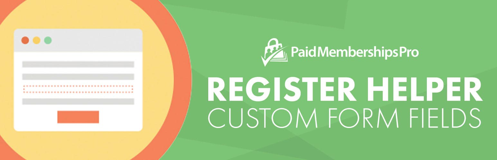

# [Paid Memberships Pro - Register Helper](https://www.paidmembershipspro.com/add-ons/pmpro-register-helper-add-checkout-and-profile-fields/) #
[comment]: # (Generate badges from shields.io, only works for .org plugins to get other stats etc. We'd have to create our own endpoints for Premium plugins)

 

### Welcome to the Paid Memberships Pro - Register Helper GitHub Repository

This robust plugin allows you to collect additional fields at membership signup. Fields can be collected at membership checkout, on the user’s profile or for administrative view-only.

For more information please visit [the Add On documentation page for this plugin](https://www.paidmembershipspro.com/add-ons/pmpro-register-helper-add-checkout-and-profile-fields/).

## Installation ##
For detailed installation steps, visit the [documentation](https://www.paidmembershipspro.com/add-ons/pmpro-register-helper-add-checkout-and-profile-fields/) page.

1. Download the current development ZIP file directly: `https://github.com/strangerstudios/pmpro-register-helper/archive/dev.zip`

**Please ensure that once installing this version of the plugin to remove `-dev` from the plugin's folder name.**

## Bugs ##
If you find an issue/bug, let us know by [creating a detailed GitHub issue](https://github.com/strangerstudios/pmpro-register-helper/issues/new/choose).

## Support ##
This is a developer's portal for Paid Memberships Pro - Register Helper. We do not offer support on this channel. **Any support related questions should be directed to [our website](https://www.paidmembershipspro.com/add-ons/pmpro-register-helper-add-checkout-and-profile-fields/).**

## Contributing to Paid Memberships Pro - Register Helper ##
We encourage and welcome any contribution to Paid Memberships Pro - Register Helper. Please read the [guidelines for contributing](https://github.com/strangerstudios/pmpro-register-helper/blob/dev/.github/CONTRIBUTING.md) to this repository.

There are various **ways to the help development** of Paid Memberships Pro - Register Helper:

1. Report [bugs/issues](https://github.com/strangerstudios/pmpro-register-helper/issues/new/choose) on GitHub.
2. Work on any issues by submitting a Pull Request.

Here are some ways for **non-developers to contribute** to Paid Memberships Pro - Register Helper:

1. Translate Paid Memberships Pro - Register Helper into your own [language](https://www.paidmembershipspro.com/paid-memberships-pro-in-your-language/).
2. [Purchase a Plus membership](https://paidmembershipspro.com/pricing) to help fund ongoing development and bug fixes.
3. Leave an honest review for [Paid Memberships Pro - Register Helper](https://wordpress.org/support/plugin/pmpro-register-helper/reviews/#new-post).
